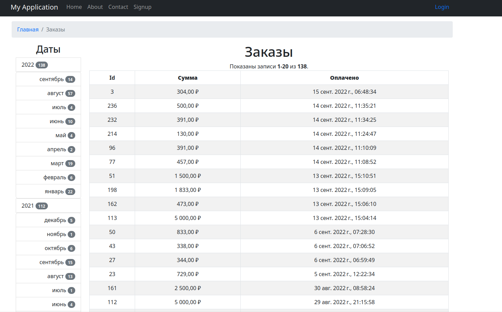

    
    <h1 align="center">Тестовое задание, фильтр заказов с использованием yii2</h1>
     

<h4>Порядок запуска:</h4>
<ol>
    <li>git clone git@github.com:igorkt/shop.git или https://github.com/igorkt/shop.git</li>
    <li>docker compose up -d</li>
    <li>Выполнить миграции docker compose run --rm backend yii migrate</li>
    <li>Открыть http://localhost:20080</li>
</ol>

